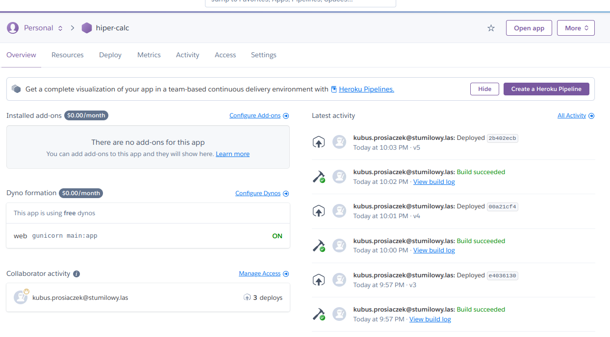

# Wrzucenie na heroku:

## Zakładamy konto na heroku

https://heroku.com
nie trzeba podawać karty kretytowej, aby korzystać dodanie jej zwiększa nam limit darmowego użycia.


## Instalacja heroku-cli
```commandline
curl https://cli-assets.heroku.com/install-ubuntu.sh | sh
```
Tutaj poprosi nas o hasło do sudo, aby zainstalować heroku cli

Jak wszystko uda się bez ofiar
```commandline
heroku --version
```
powinno nam zwrócić wersje heroku-cli

## Logowanie

```commandline
heroku login
```
powinno się pokazać coś w stylu:
```commandline
heroku: Press any key to open up the browser to login or q to exit: 
```
dajemy dowolny klawisz otworzy się nam przeglądarka i poprosi o zalogowanie do heroku jak się uda to w konsoli dostaniemy:

```commandline
Opening browser to https://cli-auth.heroku.com/auth/cli/browser/DZIWNYCIAGZNAKOW?requestor=BARDZODUZOKRZAKOW
Logging in... done
Logged in as kubus.prosiaczek@stumilowy.las!
```

## Deploy aplikacji do heroku

### Plik z bibliotekami z jakich bedziemy korzystać

Pliczek requirements.txt
```requirements.txt
flask
gunicorn
```
Flask-a już znacie :)

gunicorn jest sewerem http obsługującym naszą aplikację


### Pokazanie heroku jak powinien uruchomić aplikację:
W pliku Procfile

```Procfile
web: gunicorn main:app
```
umieszczamy jedną linijkę 
web oznacza, że to będzie nasz kontener webowy, który uruchamia gunicorna z `main:app`

jest to wskazanie, że aplikacja będzie uruchamiać się z pliku `main.py`, będzie działać przez zmienna `app`, która jest naszą aplikacją flaskową

## Inicjujemy nasze repozytorium (jesli tego wcześniej nie zrobiliśmy)

```commandline
git init
```

## Dodajemy nasze zmiany

```commandline
git add .
git commit -m 'Ważne zmiany'
```

## Tworzymy aplikacje w heroku
!!*Uwaga nazwa aplikacji musi być unikalna w heroku*!!
```commandline
heroku create nazwa-aplikacji
```
wynik będzie mniej więcej taki:
```commandline
Creating ⬢ nazwa-aplikacji... done
https://nazwa-aplikacji.herokuapp.com/ | https://git.heroku.com/nazwa-aplikacji.git
```
Powiązujemy nasze repo z heroku, aby łatwiej wypychać zmiany
```commandline
heroku git:remote --app nazwa-aplikacji
```

## Deploy niech się dzieje magia

```commandline
git push heroku master
```
W konsoli będzie się dużo dziać
```commandline
Enumerating objects: 5, done.
Counting objects: 100% (5/5), done.
Delta compression using up to 8 threads
Compressing objects: 100% (3/3), done.
Writing objects: 100% (5/5), 751 bytes | 751.00 KiB/s, done.
Total 5 (delta 0), reused 0 (delta 0)
remote: Compressing source files... done.
remote: Building source:
remote: 
remote: -----> Building on the Heroku-20 stack
remote: -----> Determining which buildpack to use for this app
remote: -----> Python app detected
remote: -----> No Python version was specified. Using the buildpack default: python-3.10.4
remote:        To use a different version, see: https://devcenter.heroku.com/articles/python-runtimes
remote: -----> Installing python-3.10.4
remote: -----> Installing pip 22.0.4, setuptools 60.10.0 and wheel 0.37.1
remote: -----> Installing SQLite3
remote: -----> Installing requirements with pip
remote:        Collecting flask
remote:          Downloading Flask-2.1.2-py3-none-any.whl (95 kB)
remote:        Collecting gunicorn
remote:          Downloading gunicorn-20.1.0-py3-none-any.whl (79 kB)
remote:        Collecting Werkzeug>=2.0
remote:          Downloading Werkzeug-2.1.2-py3-none-any.whl (224 kB)
remote:        Collecting click>=8.0
remote:          Downloading click-8.1.3-py3-none-any.whl (96 kB)
remote:        Collecting Jinja2>=3.0
remote:          Downloading Jinja2-3.1.2-py3-none-any.whl (133 kB)
remote:        Collecting itsdangerous>=2.0
remote:          Downloading itsdangerous-2.1.2-py3-none-any.whl (15 kB)
remote:        Collecting MarkupSafe>=2.0
remote:          Downloading MarkupSafe-2.1.1-cp310-cp310-manylinux_2_17_x86_64.manylinux2014_x86_64.whl (25 kB)
remote:        Installing collected packages: Werkzeug, MarkupSafe, itsdangerous, gunicorn, click, Jinja2, flask
remote:        Successfully installed Jinja2-3.1.2 MarkupSafe-2.1.1 Werkzeug-2.1.2 click-8.1.3 flask-2.1.2 gunicorn-20.1.0 itsdangerous-2.1.2
remote: -----> Discovering process types
remote:        Procfile declares types -> web
remote: 
remote: -----> Compressing...
remote:        Done: 61.8M
remote: -----> Launching...
remote:        Released v3
remote:        https://hiper-calc.herokuapp.com/ deployed to Heroku
remote: 
remote: Verifying deploy... done.
To https://git.heroku.com/hiper-calc.git
 * [new branch]      master -> master

```
W moim przypadku aplikacja jest dostępna pod
https://hiper-calc.herokuapp.com/

## Co jak coś pójdzie nie tak 

- Wchodzimy na www i mamy błąd
  - odpalamy w consoli
    ```commandline
    heroku logs --tail
    ```
    zwraca on nam log z aplikacji jakie mamy. Jest to podobny log jak mamy aplikacje odpale lokalnie to co nam np flask wypluwa jak coś jest nie tak
    ```commandline
    2022-05-31T19:57:50.704991+00:00 app[web.1]: ModuleNotFoundError: No module named 'main.app'; 'main' is not a package
    2022-05-31T19:57:50.705098+00:00 app[web.1]: [2022-05-31 19:57:50 +0000] [10] [INFO] Worker exiting (pid: 10)
    2022-05-31T19:57:50.738202+00:00 app[web.1]: [2022-05-31 19:57:50 +0000] [4] [WARNING] Worker with pid 10 was terminated due to signal 15
    ```
    możemy na podstawie tego też zobaczyć co się dzieje z apką

## Panel heroku aplikacji
